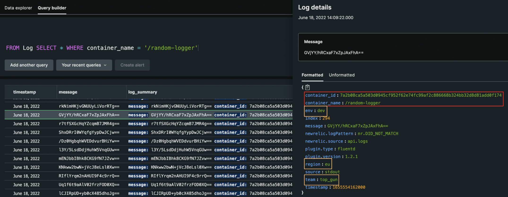

# Introduction

This repo is to dedicated to showcase how to:
1. collect logs out of the Docker containers running on a Ubuntu machine
2. forward them to New Relic
3. query & inspect them regarding container name

# Setup

The demo is considered to run on a fresh Ubuntu machine (e.g. Ubuntu 18.04 LTS). Recommended way would be to fire up a VM (AWS EC2, Azure VM...) by referring the content within `user_data.sh`.

The VM will then first be provisioned and start to run the commands within `user_data.sh` right afterwards so you don't have to do anything at all regarding configuration.

# Components

The entry point to the setup is basically the `user_data.sh`. This script creates an `/app` directory and clones this repository into it.

**REMARK:** Before provisioning the VM, set the necessary variables in the script!
```
bash run_setup.sh \
  --license-key <YOUR_NEWRELIC_LICENCE_KEY> \
  --logging-endpoint <YOUR_NEWRELIC_LOGGING_ENDPOINT> \
  --logging-level <YOUR_FLUENTD_LOGGING_LEVEL>
```

* `--license-key` is your New Relic license key
* `--logging-endpoint` is the log API depending where your account is
   * US: https://log-api.newrelic.com/log/v1
   * EU: https://log-api.eu.newrelic.com/log/v1
* `--logging-level` can be one of the following: `fatal, error, warn, info, debug, trace`
   * recommended value is `info`

Within that repository, it runs the `run_setup.sh` script which configures the whole setup that contains the following 3 steps:
1. Install Docker onto the Ubuntu VM
2. Build and run custom New Relic logging agent
3. Build and run a random logger application

## 1- Installing Docker

The folder `/01_docker` contains the `01_install_docker.sh` script which is removing & reinstalling the Docker.

## 2- Building & Running New Relic Logging Agent

The folder `02_newrelic` contains the custom Dockerfile which extends the fluentd image `fluent/fluentd:v1.9.2-1.0`.

It copies the custom fluentd configuration file `fluent.conf` where forwarding the logs to New Relic and adding custom attributes are already set up.

## 3- Building & Running Random Logger

The folder `03_random_logger` contains a very simple application which logs a random string to `STDOUT` very 5 seconds.

# Important Points

## Applications in Docker containers

In order for the applications in Docker containers on the host machine to forward their logs to our custom fluentd image, the `docker run` command should contain the correct log driver.

The snippet below sets the log driver to `fluend` and it's address.

```
# Start random logger
sudo docker run \
  -d \
  --name $randomLoggerName \
  --log-driver="fluentd" \
  --log-opt "fluentd-address=localhost:24224" \
  $randomLoggerName
```

## Custom Fluntd Container

In order for our custom fluentd container to receive the logs from the application Docker containers, it has to be reachable per the port `24224`.

The snippet below opens the communication from container to host machine on the port `24224`.

```
# Start New Relic logging agent
sudo docker run \
  -d \
  --name $newrelicLoggingAgentName \
  -p 24224:24224 \
  $newrelicLoggingAgentName
```

# Inspecting Logs in New Relic UI

In order to view the logs of a particular container, the following NRQL query can be used:
`FROM Log SELECT * WHERE container_name = '/random-logger'`

The result will look as follows:

